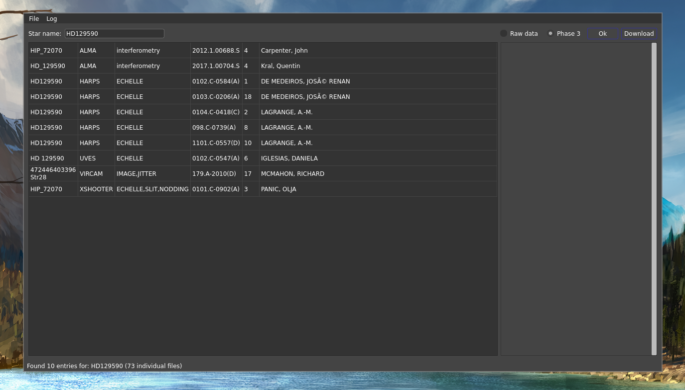

# ESOQuery



Package to browse and explore the ESO archive. This should be the equivalent of searching from the official raw [ESO archive](http://archive.eso.org/eso/eso_archive_main.html) but the results should be presented in a more comprehensible way.

Indeed, instead of having endless pages with one fits file per line, this package groups several fits files together, depending on the program ID and when the observations were taken. Therefore, at a quick glance, you can see how many times your favorite star has been observed with different instruments.

There is the possibility to query for the raw data or the phase 3 data.

## Query parameters

Starting a query is fairly simple, you can only query for a star name (query per program ID or observing night for instance is not supported). And you can query either for Phase 3 data, or for the raw data. If you're interested in the raw data, you can select which instruments you want to query.

### A note on the raw data query

The phase 3 query is done using astroquery and it is quite fast. On the other hand, for the raw data, the program needs to find some keywords of the headers that are not always included in the general astroquery package. Therefore, this package uses the SQL query that is provided by ESO. In general, this method is slower than using astroquery, especially if you are asking for many instruments. 

## Displaying results

Once the query is done, if there are some results, they will be displayed in a Table with the following columns, *for the Phase 3 data*:

- OBJECT name: the name found in the header
- Instrument
- Mode
- Program ID
- Number of files
- PI

For the raw data query, the columns are:

- OBJECT name: the name found in the header
- Instrument
- Mode
- Program ID
- Observing date
- Release date
- Number of files
- PI and CoIs

On top of that, for both queries, on the right side there will be additional information about the selected row.

## Preferences

Preferences can be accessed by clicking on the `File` button in the upper left corner of the interface.

The package will create a directory in $HOME/.config/esoquery/, meaning that all preferences are stored locally and will stay on your computer. There is only one file saved there:

- esoquery.conf: contains the login and password (saved locally, hence private), a directory where to save the data, and a list of your favorite instruments.

In the preferences window, you can select the instruments that you would like to query for the raw data query (it doesn't matter for the phase 3 query). As mentioned before, querying for all instruments at once might be very slow and may result in a time out of the query. The instrument that you selected will appear in a drop-down menu on the main interface once you select `Raw data`.

## Data download

After doing one query, you can select one of the row and press the `Download` button. There will be a pop-up window showing up where you can access the `Preferences` in case you need to change the download directory, and you can also select the kind of data you want. You can select from the following three options:

- Science files only
- Science and raw calibration files
- Science and processed calibration files

The first option will always be faster than the other two since the calibration cascade does not have to be run.

Once you start downloading something, there should be a progress bar that appears at the bottom of the interface, and you should not be able to use the program for a while (to avoid starting multiple download at the same time, I doubt this would work very well).

For the Phase 3 data, this choice does not matter since there is no calibration cascade to be run.

## Requirements

The requirements can be found below. The main interface is done using `PyQt5`. There are some scripts that come directly from the ESO webpages (`eso_programmatic.py`) which are using the `pyvo` package.

```python
astropy==5.0.4
astroquery==0.4.6
matplotlib==3.4.3
numpy==1.17.4
PyQt5==5.15.9
pyvo==1.3
requests==2.22.0
xmltodict==0.12.0

```

## Operating systems and such

This package has only been tested on Linux, I have not idea if/how it will work on MacOS or Windows.

On Ubuntu, I added a file `esoquery.desktop` in `$HOME/.local/share/applications` containing the following:

```
[Desktop Entry]
Name=ESOQuery
GenericName=ESOQuery
Exec=python3 <path to the folder you downloaded>/EsoQuery/ESOQuery.py
Terminal=false
Type=Application
```

This should allow to start the application from your favorite launcher.

Otherwise, you can go to the folder where you downloaded this repository and start it using `python3 ESOQuery.py`.

## TODO

- [ ] ALMA data for Phase 3 cannot be downloaded at the moment. 
